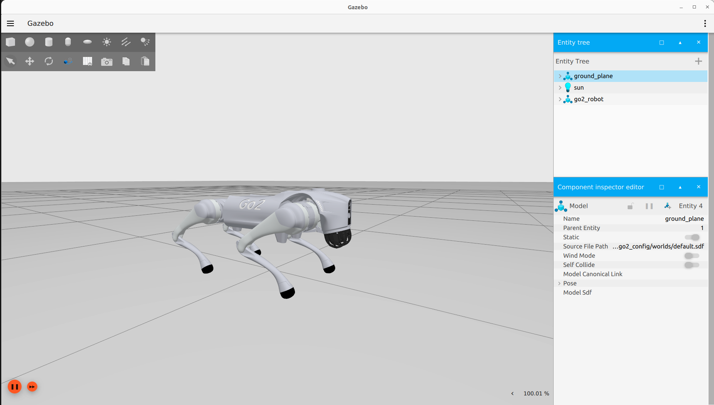
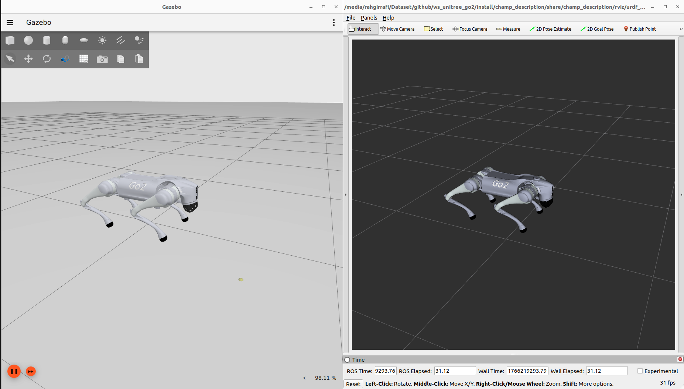
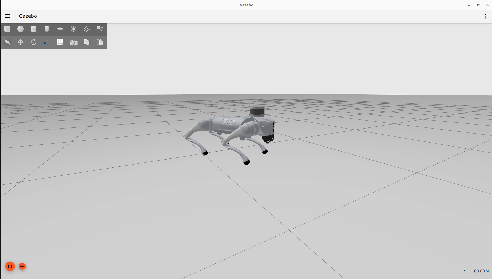
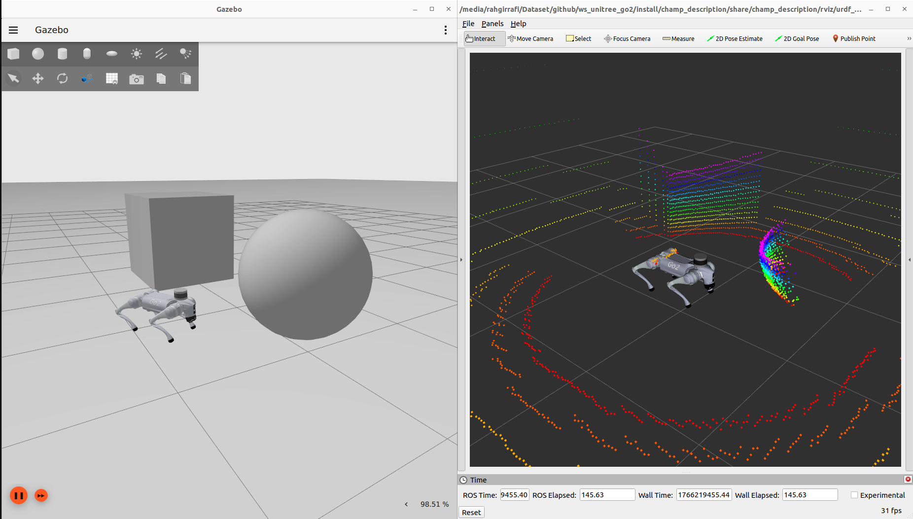

# Unitree Go2 ROS 2 - CHAMP Controller

> ROS 2 Humble package for the Unitree Go2 quadruped robot using the CHAMP controller framework with Ignition Fortress (Gazebo) simulation. Features teleoperation, 3D LiDAR (Velodyne), IMU, and 2D LiDAR support.

## Unitree Go2:
<div style="display: flex; gap: 50px;">
  
   
</div>

> Unitree Robotics is focusing on the R&D, production, and sales of consumer and industry-class high-performance general-purpose legged and humanoid robots, six-axis manipulators, and so on. They attach great importance to independent research and development and technological innovation, fully self-researching key core robot components such as motors, reducers, controllers, LIDAR and high-performance perception and motion control algorithms, integrating the entire robotics industry chain.

## CHAMP Controller:


> CHAMP is an open source development framework for building new quadrupedal robots and developing new control algorithms. The control framework is based on [*"Hierarchical controller for highly dynamic locomotion utilizing pattern modulation and impedance control : implementation on the MIT Cheetah robot"*](https://dspace.mit.edu/handle/1721.1/85490).

## Resources:
- [Go2 Description (URDF model)](https://github.com/unitreerobotics/unitree_ros/tree/master/robots/go2_description) 
- [CHAMP Robots (configs)](https://github.com/chvmp/robots)
- [CHAMP Controller](https://github.com/chvmp/champ)
- [Velodyne Simulator](https://github.com/rahgirrafi/velodyne_simulator_ros2_gz.git)

## Tested on:
- Ubuntu 22.04 (ROS 2 Humble)
- Ignition Fortress (Gazebo)

## Features:

- ✅ Go2 robot configured with CHAMP controller
- ✅ Robot description ported to ROS 2
    - ✅ URDF with ros2_control tags
    - ✅ Launch files for ROS 2
    - ✅ Configuration files for ROS 2
- ✅ Ignition Fortress simulation
- ✅ RViz visualization
- ✅ Teleoperation support
- ✅ IMU sensor
- ✅ 2D LiDAR (Hokuyo)
- ✅ 3D LiDAR (Velodyne VLP-16)
- ⬜ SLAM integration
- ⬜ Nav2 integration

## 1. Installation

### 1.0 Clone the repository:
    
```bash
cd <your_ws>/src
git clone https://github.com/rahgirrafi/unitree-go2-ros2.git
cd unitree-go2-ros2

# Initialize and update the velodyne submodule
git submodule update --init --recursive
```

> **Note:** The velodyne lidar package is included as a git submodule. If you've already cloned the repository without the `--recursive` flag, run `git submodule update --init --recursive` to fetch the submodule.

### 1.1 Install dependencies using rosdep:

```bash
# Install rosdep if not already installed
sudo apt install -y python3-rosdep

# Initialize rosdep (only needed once)
sudo rosdep init  # Skip if already initialized
rosdep update

# Install all dependencies
cd <your_ws>
rosdep install --from-paths src --ignore-src -r -y
```

### 1.2 Build your workspace:
```bash
cd <your_ws>
colcon build
. <your_ws>/install/setup.bash
```
## 2. Quick Start

You don't need a physical robot to run the following demos. All dependencies will be installed via rosdep.

### 2.1 Basic Simulation
Run the Ignition Fortress simulation:
```bash
ros2 launch go2_config gazebo.launch.py
```


### 2.2 Simulation with RViz
Run the simulation with RViz visualization:
```bash
ros2 launch go2_config gazebo.launch.py rviz:=true
```


### 2.3 Teleoperation
Control the robot using keyboard:
```bash
ros2 run teleop_twist_keyboard teleop_twist_keyboard
```

### 2.4 Velodyne 3D LiDAR Simulation
Run the simulation with Velodyne VLP-16 3D LiDAR:
```bash
ros2 launch go2_config gazebo_velodyne.launch.py 
```


### 2.5 Velodyne with RViz Point Cloud
Run the Velodyne simulation with RViz to visualize point cloud data:
```bash
ros2 launch go2_config gazebo_velodyne.launch.py rviz:=true
```

> **Note:** Set point cloud topic to `/velodyne_points` in RViz.



### 2.6 Hokuyo 2D LiDAR Configuration

To use a 2D laser scanner instead of the 3D Velodyne LiDAR:

1. Open `robots/descriptions/go2_description/xacro/robot_VLP.xacro`
2. Comment out: `<xacro:include filename="$(find go2_description)/xacro/velodyne.xacro"/>`
3. Uncomment: `<xacro:include filename="$(find go2_description)/xacro/laser.xacro"/>`
4. Rebuild the workspace

Then launch:
```bash
ros2 launch go2_config gazebo_velodyne.launch.py rviz:=true
```

## 3. Tuning Gait Parameters

The gait configuration for your robot can be found in `go2_config/config/gait/gait.yaml`.


| Parameter | Unit | Description |
|-----------|------|-------------|
| **Knee Orientation** | - | How the knees should be bent. Configure as `.>>` `.><` `.<<` `.<>` where dot is the front of the robot. |
| **Max Linear Velocity X** | m/s | Robot's maximum forward/reverse speed. |
| **Max Linear Velocity Y** | m/s | Robot's maximum speed when moving sideways. |
| **Max Angular Velocity Z** | rad/s | Robot's maximum rotational speed. |
| **Stance Duration** | s | How long each leg spends on the ground while walking. Default: 0.25s. |
| **Leg Swing Height** | m | Trajectory height during swing phase. |
| **Leg Stance Height** | m | Trajectory depth during stance phase. |
| **Robot Walking Height** | m | Distance from hip to ground while walking. Setting too high can cause instability. |
| **CoM X Translation** | m | Shift reference point in X axis to compensate for uneven weight distribution. |
| **Odometry Scaler** | - | Multiplier for dead reckoning velocities. Typically 1.0 to 1.20. |

## Contributing

Contributions are welcome! Please feel free to submit a Pull Request.

1. Fork the repository
2. Create your feature branch (`git checkout -b feature/AmazingFeature`)
3. Commit your changes (`git commit -m 'feat: Add some AmazingFeature'`)
4. Push to the branch (`git push origin feature/AmazingFeature`)
5. Open a Pull Request

## License

This project is open source. See individual package licenses for details.

## Acknowledgements

This project builds upon and incorporates work from the following projects:

* [Unitree Robotics](https://github.com/unitreerobotics/unitree_ros) - Go2 robot description (URDF model)
* [CHAMP](https://github.com/chvmp/champ) - Quadruped controller framework
* [CHAMP Robots](https://github.com/chvmp/robots) - Robot configurations and setup examples
* [Velodyne Simulator](https://github.com/rahgirrafi/velodyne_simulator_ros2_gz.git) - Velodyne LiDAR simulation for Ignition Fortress

We are grateful to the developers and contributors of these projects for their valuable work.
